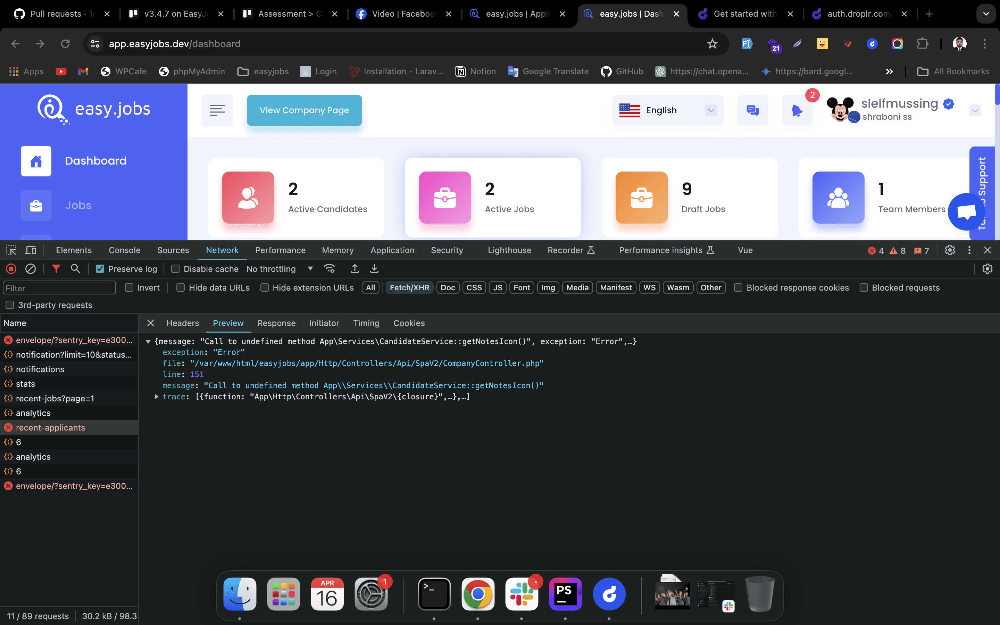
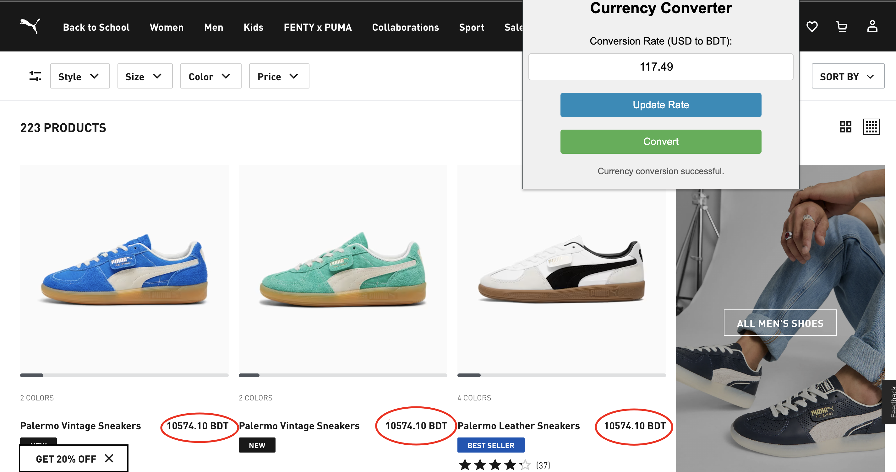

# Currency Converter Chrome Extension


## Overview

Currency Converter Chrome Extension automatically converts USD prices to BDT on any website you visit. It fetches the latest conversion rates and provides a simple and intuitive interface for quick updates.

## Features

- **Automatic Conversion**: Detects and converts USD prices to BDT on any webpage.
- **Real-Time Rates**: Fetches the latest USD to BDT conversion rate from a free API.
- **Manual Update**: Allows users to manually update the conversion rate.
- **Popup Interface**: Easy-to-use popup interface to update conversion rates and trigger conversions.
- **Storage**: Remembers the last fetched conversion rate for offline use.

## Installation

1. **Clone the Repository**
   ```bash
   git clone https://github.com/Alamin30/currency-converter-chrome-extension.git
   cd currency-converter-chrome-extension

2. **Load the Extension in Chrome**
   
- Open Chrome and go to chrome://extensions/.
- Enable "Developer mode" by toggling the switch in the upper right.
- Click on the "Load unpacked" button and select the cloned repository folder.

## Usage

- Visit any website with prices in USD.
- Click on the extension icon in the Chrome toolbar.
- Click "Update Rate" to fetch the latest USD to BDT conversion rate.
- Click "Convert" to convert all detected USD prices to BDT.

## Screenshots





## Contributing

Contributions are welcome! Please read the contributing guidelines first.

## License
This project is licensed under the MIT License - see the LICENSE file for details.

## Acknowledgments
[ExchangeRate-API](https://www.exchangerate-api.com/) for providing the free exchange rate data.


